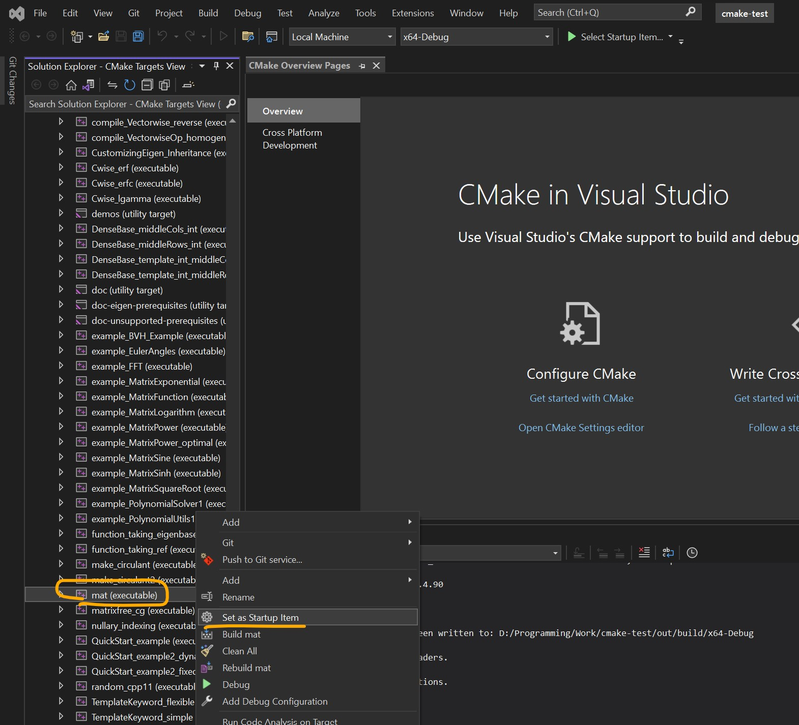
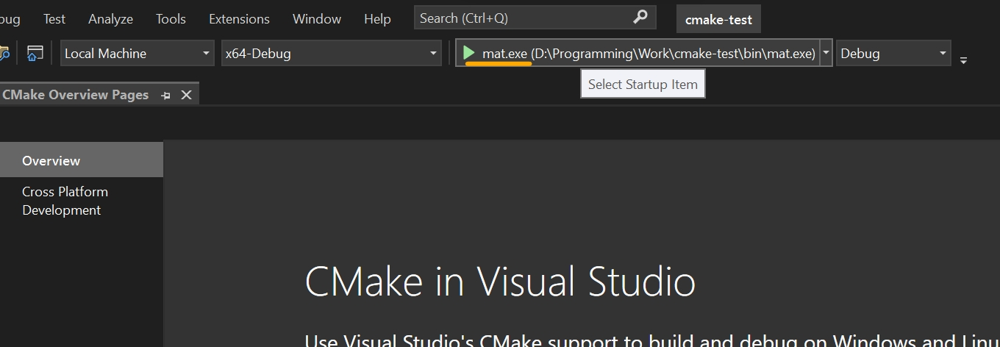

# How to build the app in Microsoft Visual Studio

## Preparations
* Clone the repository using git
* Initialize and update git submodule
* Install msvc-compiler on you windows-machine

## Build flow:
Please follow the images below to build the *mat* executable using Microsoft Visual Studio

1. 
2. 
3. 
4. 