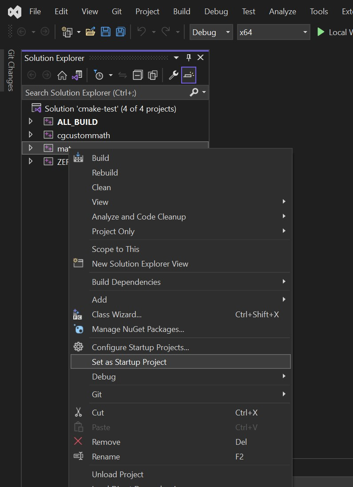
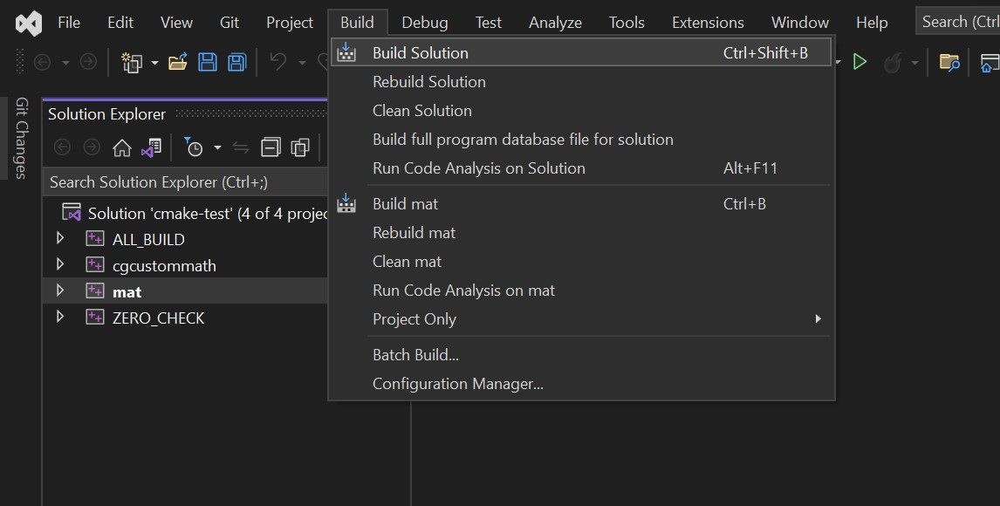

# How to build the app in Microsoft Visual Studio

## Preparations
* Clone the repository using git
* Initialize and update git submodule
* Install [Conan](https://docs.conan.io/2/installation.html)
* Install msvc-compiler on you windows-machine
* Have *CMake* in your environment PATH

## Build flow:
Please follow the images below to build the *mat* executable using Microsoft Visual Studio

Run the following script:

```cd scripts```

```./create-vs-project.sh```

open ```build/cmake-test.sln``` with Visual Studio and then follow instructions as shown in images below:

1. 
2. 
